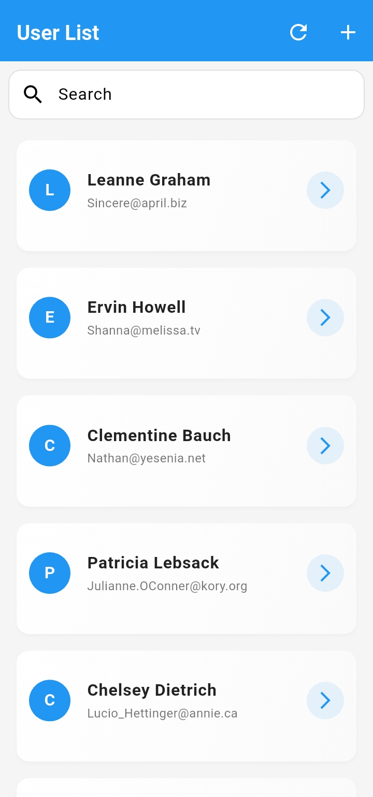
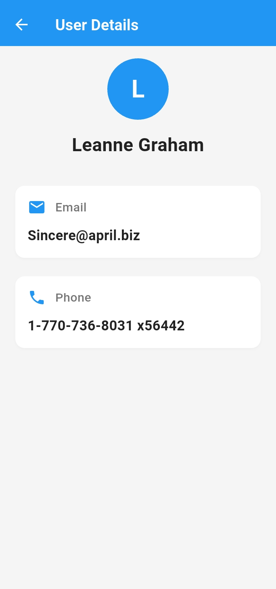
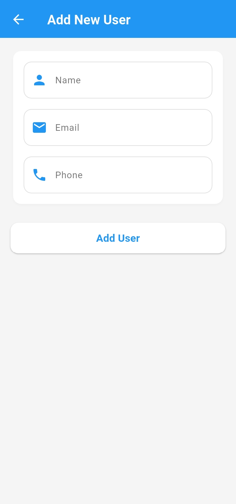

# 👥 Flutter User App

A Flutter application built as part of an internship assignment to demonstrate **responsive UI**, **state management**, and **REST API integration**.

---

## 📱 Features

- ✅ Fetch and display user data from a REST API.
- ✅ View detailed information of a selected user.
- ✅ Add new users locally with a form (Name, Email, Phone).
- ✅ Responsive UI for mobile, tablet, and desktop.
- ✅ State management using **Provider**.
- ✅ Search functionality to filter users.
- ✅ Smooth transitions with animations.
- ✅ Error handling for API failures or no internet.

---

## 🔗 API Endpoint Used

GET https://jsonplaceholder.typicode.com/users

---

### 📸 Screenshots

<table>
  <tr>
    <td align="center">
      <br>
      <strong>🏠 Home Page</strong>
    </td>
    <td align="center">
      <br>
      <strong>ℹ️ User Detail Page</strong>
    </td>
    <td align="center">
      <br>
      <strong>➕ Add User Page</strong>
    </td>
  </tr>
</table>


---

## 🛠️ Tech Stack

- **Flutter**
- **Dart**
- **Provider** (State Management)
- **HTTP** (REST API calls)
- **Responsive Layout** using `MediaQuery`, `LayoutBuilder`

---

## 🚀 Getting Started

### ✅ Prerequisites

- [Flutter SDK](https://flutter.dev/docs/get-started/install)
- IDE: VS Code / Android Studio
- Emulator or Physical Device

### 📦 Installation Steps

```bash
# Clone the repository
https://github.com/DeepaKumawat89/SeekHelpers_Assignment.git
cd SeekHelpers_Assignment

# Install dependencies
flutter pub get

# Run the app
flutter run


